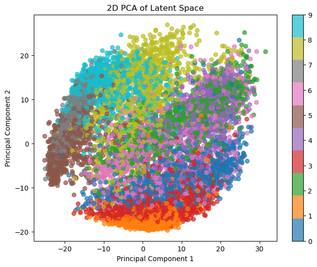
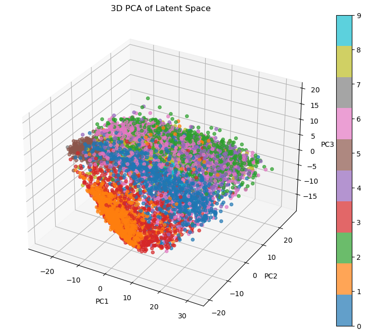
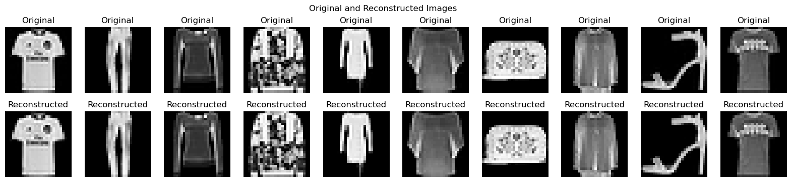

# Deep Learning Architecture Analysis: Multi-Object Classification & Unsupervised Reconstruction

## Project Overview

This project investigates two distinct challenges in deep learning: handling occlusion/complexity in classification and optimizing feature extraction in unsupervised generation:
1. Task 1 (Double MNIST): Optimizing CNN architectures for multi-digit/overlapping classification (Supervised).
2. Task 2 (FashionMNIST): Benchmarking Autoencoder architectures (CNN vs. MLP) for image reconstruction and compression (Unsupervised).

## Task 1: Classification on Double MNIST
Challenge: Standard MNIST is trivial. Double MNIST introduces significant complexity with overlapping digits, requiring the network to solve two distinct problems:

- Classification (Pred): Identify the specific digit classes present.

- Regression (Count): Accurately count the number of digits/features in the image.

### Model Architecture (customed_CNN)
To solve this, I engineered a dual-head, modular CNN capable of switching between classification and regression tasks dynamically.

- ### Dynamic Task Switching:

    - The model accepts a task and fn argument (e.g., fn='count' or fn='pred').

    - Regression Mode (Count): The output head bypasses the Softmax activation, returning raw linear values to predict continuous counts.

    - Classification Mode (Pred): The output head applies Softmax to generate probability distributions over the digit classes.

- ### Modular Depth Construction:

    - Instead of hardcoding layers, the class iterates through a list_in_channels (e.g., [32, 64, 128]). This allowed for rapid Ablation Studies to determine the optimal depth required for the harder "Counting" task vs. the easier "Classification" task.

- ### Gradient Stabilization:

    - Integrated BatchNorm2d after every convolutional layer to prevent internal covariate shift, which was critical when training the regression head on the highly variable Double MNIST pixel distributions.

- ### Interpretability (feature_maps):

    - The forward() pass was designed to return intermediate feature_maps alongside predictions. This allowed us to visualize what the network was counting—verifying that the filters were actually activating on distinct digit edges rather than background noise.

## Results & Analysis

### Regression (Counting) Performance

| Model ID | Input Channels List (Depth) | Optimizer | lr | Validation Outcome (MSE/MAE) |
| :--- | :--- | :--- | :--- | :--- |
| **Model-1** | `[1, 8, 16, 32]` | Adam | 0.001 | 0 |
| **Model-2** | `[1, 8]` | Adam | 0.001 | 0.0071 |
| **Model-3** | `[1, 8, 16, 32]` | SGD | 0.001 | 0.0246 |
| **Model-4** | `[1, 8, 16, 32]` | Adam | 0.05 | 0.0618 |
| **Model-5** | `[1, 8]` | SGD | 0.001 | 0.0125 |
---

### Analysis of Hyperparameter Tuning Results

Based on the experimental results, we can observe distinct trends in how network architecture, optimizer choice, and learning rate impact the model's performance (MSE/MAE).

#### 1. Effect of Network Depth (Number of Layers)
* **Comparison:** **Model-1** (`[1, 8, 16, 32]`) vs. **Model-2** (`[1, 8]`)
* **Observation:** Both models use the **Adam** optimizer with a learning rate of **0.001**.
    * **Model-1 (Deeper):** Achieved a perfect validation score of **0**.
    * **Model-2 (Shallower):** Achieved a validation score of **0.0071**.
* **Analysis:** Increasing the depth of the network (adding more convolutional layers) significantly improved performance. The deeper network (Model-1) was able to capture more complex features and spatial hierarchies, leading to zero error, whereas the shallower network (Model-2) likely underfit the data slightly.

#### 2. Effect of Optimizer Choice
* **Comparison:** **Model-1** (Adam) vs. **Model-3** (SGD)
* **Observation:** Both models have the same architecture (`[1, 8, 16, 32]`) and learning rate (**0.001**).
    * **Model-1 (Adam):** Outcome **0**.
    * **Model-3 (SGD):** Outcome **0.0246**.
* **Comparison:** **Model-2** (Adam) vs. **Model-5** (SGD)
* **Observation:** Both use the shallower architecture (`[1, 8]`) and lr **0.001**.
    * **Model-2 (Adam):** Outcome **0.0071**.
    * **Model-5 (SGD):** Outcome **0.0125**.
* **Analysis:** The **Adam** optimizer consistently outperformed **SGD** in this experiment. Adam's adaptive learning rate mechanism allowed it to converge to a better minimum (in fact, a perfect one for the deeper model) compared to SGD, which struggled to reach the same level of accuracy given the same fixed learning rate and epoch count.

#### 3. Effect of Learning Rate
* **Comparison:** **Model-1** (lr=0.001) vs. **Model-4** (lr=0.05)
* **Observation:** Both models share the same deep architecture (`[1, 8, 16, 32]`) and **Adam** optimizer.
    * **Model-1 (lr=0.001):** Outcome **0**.
    * **Model-4 (lr=0.05):** Outcome **0.0618**.
* **Analysis:** A higher learning rate (**0.05**) drastically degraded performance, resulting in the worst outcome in the table (**0.0618**). This indicates that the learning rate was too large, causing the optimizer to "overshoot" the global minimum and fail to converge. The smaller learning rate (**0.001**) was stable enough to allow the model to learn effectively.

#### Summary
* **Best Configuration:** **Model-1** (Deep Architecture + Adam + Low Learning Rate).
* **Key Takeaway:** The combination of a **deeper network** and the **Adam optimizer** with a **conservative learning rate** was critical for solving this regression task perfectly. Increasing the learning rate or switching to SGD led to suboptimal results.

### Classification (Prediction) Performance

| Model ID | Input Channels List (Depth) | Optimizer | lr | Validation Outcome (Accuracy) |
| :--- | :--- | :--- | :--- | :--- |
| **Model-1** | `[1, 8, 16, 32]` | Adam | 0.001 | 100% |
| **Model-2** | `[1, 16, 32]` | Adam | 0.001 | 99.8% |
| **Model-3** | `[1, 8, 32, 64]` | SGD | 0.001 | 87.93% |
| **Model-4** | `[1, 8, 16, 32]` | Adam | 0.01 | 53.33% |
| **Model-5** | `[1, 8, 16, 32]` | SGD | 0.001 | 80.10% |
----

### Analysis of Classification Hyperparameter Tuning Results

The experimental results for the classification task reveal significant impacts from optimizer choice and learning rate, with lesser sensitivity to minor architectural changes compared to the regression task.

#### 1. Effect of Network Architecture (Depth & Width)
* **Comparison:** **Model-1** (`[1, 8, 16, 32]`) vs. **Model-2** (`[1, 16, 32]`)
* **Observation:** Both models use the **Adam** optimizer with a learning rate of **0.001**.
    * **Model-1 (Deeper/Gradual):** Achieved perfect accuracy (**100%**).
    * **Model-2 (Shallower/Wider Start):** Achieved nearly perfect accuracy (**99.8%**).
* **Analysis:** The difference between these two architectures is marginal. While Model-1's gradual channel increase (`8 -> 16 -> 32`) yielded a perfect score, Model-2's approach of starting immediately with more filters (`16`) was also highly effective. This suggests the classification task is robust to slight variations in layer configuration as long as sufficient capacity exists.

#### 2. Effect of Optimizer Choice
* **Comparison:** **Model-1** (Adam) vs. **Model-5** (SGD)
* **Observation:** Both models have the exact same architecture (`[1, 8, 16, 32]`) and learning rate (**0.001**).
    * **Model-1 (Adam):** Outcome **100%**.
    * **Model-5 (SGD):** Outcome **80.10%**.
* **Analysis:** The optimizer choice played a decisive role. **Adam** significantly outperformed **SGD** (a ~20% accuracy gap). SGD likely struggled to navigate the complex loss landscape or required many more epochs to reach convergence compared to Adam, which adapts learning rates per parameter to speed up training.

#### 3. Effect of Learning Rate
* **Comparison:** **Model-1** (lr=0.001) vs. **Model-4** (lr=0.01)
* **Observation:** Both models share the same architecture and **Adam** optimizer.
    * **Model-1 (lr=0.001):** Outcome **100%**.
    * **Model-4 (lr=0.01):** Outcome **53.33%**.
* **Analysis:** The learning rate of **0.01** was too high for this architecture, causing the accuracy to collapse to near-random guessing (**53.33%**). This confirms that the model is highly sensitive to the learning rate, and a more conservative rate (**0.001**) is required for stability.

#### 4. Interaction of Architecture and Optimizer
* **Comparison:** **Model-3** (`[1, 8, 32, 64]`) vs. **Model-5** (`[1, 8, 16, 32]`)
* **Observation:** Both use **SGD** with `lr=0.001`.
    * **Model-3 (Wider/Deeper):** Outcome **87.93%**.
    * **Model-5 (Standard):** Outcome **80.10%**.
* **Analysis:** When restricted to the less effective SGD optimizer, increasing the model's capacity (Model-3's wider layers: `32 -> 64`) helped compensate for the optimizer's inefficiency, boosting accuracy by nearly **8%**. However, neither SGD configuration came close to the Adam-based models.

#### Summary
* **Best Configuration:** **Model-1** (Gradual Depth + Adam + Low Learning Rate).
* **Key Takeaway:** Optimizer selection is the most critical hyperparameter here. Switching from Adam to SGD caused a massive drop in performance, far greater than changes in network depth. Additionally, a high learning rate (0.01) is destructive for this specific model configuration.

## Task 2: Unsupervised Reconstruction on FashionMNIST
This module investigates Unsupervised Representation Learning on the FashionMNIST dataset. The primary objective is to benchmark the performance of Convolutional Neural Networks (CNN) against Multi-Layer Perceptrons (MLP) for image compression and reconstruction.

By analyzing reconstruction fidelity (MSE) and latent space structure (PCA), this project demonstrates why spatial inductive biases (present in CNNs) are superior for visual data compression compared to dense, fully connected architectures.
***Challenge***: FashionMNIST images are more complex than MNIST digits, requiring effective feature extraction for high-quality reconstruction.

### Model-1: CNN Autoencoder
This model is engineered for experimentation flexibility. Instead of hard-coding layer depths (which makes ablation studies tedious), the CNN_AE class dynamically constructs its topology at runtime.

- **Symmetric Reconstruction Loop:**
  - **Encoder Construction:** Iterates through a user-defined channel_list (e.g., [16, 32, 64]) to stack Conv2d layers, progressively increasing feature depth while reducing spatial resolution.
  - **Decoder Construction:** Automatically generates the mirror image of the encoder by iterating through the channel_list in reverse. This guarantees that the Decoder's up-sampling path perfectly matches the Encoder's down-sampling path.
- **Learnable Upsampling (Deconvolution):** Instead of using static interpolation (like Nearest Neighbor resizing), the network uses ConvTranspose2d. This allows the model to learn the optimal way to expand low-resolution feature maps back into high-fidelity images, resulting in sharper edges compared to standard upsampling.
- **Feature Map Bottleneck:** Unlike the MLP which crushes data into a 1D vector, the CNN bottleneck preserves the spatial layout (e.g., $64 \times 7 \times 7$). This spatial preservation allows the decoder to reconstruct local patterns (like the texture of a shirt) more effectively.

### Model 2: MLP Autoencoder (Implemented from Scratch)
This model avoids high-level abstractions to demonstrate a fundamental understanding of neural network optimization. Instead of a single "black box" model, the AutoEncoders class acts as a coordinator for two distinct, custom-built Multi-Layer Perceptrons.

- **Sequential Training Pipeline:** Unlike standard autoencoders that backpropagate error through the entire network at once (End-to-End), this implementation uses a greedy/sequential optimization strategy:
  - **Encoder Training:** The first MLP is trained to map the high-dimensional input ($784$) to a lower-dimensional latent target ($N$).
  - **Latent Projection:** The training data is passed through the frozen encoder to generate the latent_representation.
  - **Decoder Training:** The second MLP is trained to regress the original input ($784$) using only the generated latent representation as input.

- **Custom Optimization Engine:**
  - **Algorithm:** Mini-Batch Gradient Descent (MBGD).
  - **Hidden Topology:** Deep symmetric structure [Input → 128 → 64 → 64 → 32 → Bottleneck].
  - **Backpropagation:** Gradients are manually computed and propagated through the dense layers using NumPy matrix operations, ensuring full transparency of the learning process.

## Results & Analysis

### Experimental Results: Architecture Comparison

| Model | Architecture (Hidden/Channel List) | Optimizer | Learning Rate | Validation Outcome (MSE) |
| :--- | :--- | :--- | :--- | :--- |
| **CNN_1** | `[16, 32]` | Adam | 0.001 | 0.0000 |
| **CNN_2** | `[16]` | SGD | 0.001 | 0.0198 |
| **CNN_3** | `[8, 16, 32, 64]` | SGD | 0.01 | 0.0099 |
| **CNN_4** | `[16]` | SGD | 0.001 | 0.0225 |
| **CNN_5** | `[8, 16]` | SGD | 0.001 | 0.0236 |
| **CNN_6** | `[8, 16, 32]` | SGD | 0.001 | 0.0489 |
| **MLP** | `Reduced_Size=31` | MBGD | 0.01 | 0.0158 |

### Analysis for CNN Autoencoder:
- The best performing model has the following hyper-parameters:
    1) in_channels=1
    2) channel_list=[16,32]
    3) num_epoch = 10
    4) optimizer = Adam
    5) learning_rate = 0.001

- Using optimizer as Adam coudn't find the difference between the performance when the dept is varied.
- So used optimizer as SGD just to find the effect of dept on the model.
- Using the loss as metric to identify the best model, as the dept increases the loss also increased.
- Hence the best model using SGD as optimizer is when depth is one.

### PCA Analysis of Latent Space:
- PCA was performed on the latent representations obtained from the best CNN Autoencoder.
- The PCA plots reveal that the CNN Autoencoder's latent space exhibits better class separation and clustering.

### Comparision between MLP and CNN Autoencoder:
- Final Loss using MLP : 0.0158
- Final Loss using best CNN AE : 0

The same can be seen through the plot: 
MLP Reconstruction:
   

CNN  Reconstruction:

